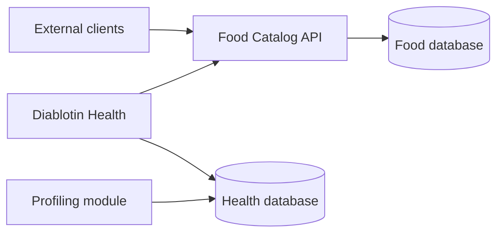

# Service boundary

Food Catalog is a generic nutritional data service. Its API contract deliberately
excludes health and patient data.

The two databases and their backups must remain separate. Diablotin retrieves a
generic nutritional reference, then performs the quantity calculation locally.
It keeps the quantity eaten, person, meal, voice transcript and retained
personal correction on the health side.

## Accepted data

- generic food names, aliases and tags;
- food preparation or brand descriptors;
- generic nutritional references and their provenance;
- a generic food identifier and its composition per 100 g.

## Forbidden data

- patient or user identifiers;
- audio recordings or voice transcripts;
- meals associated with a person;
- glucose, insulin, treatment or diagnosis data;
- personalized nutritional corrections;
- free-text medical context.

Personal references remain in the calling health application. Observability,
support exports and API logs must follow the same boundary. Client applications
must not place forbidden information in query strings, headers or correlation IDs.
